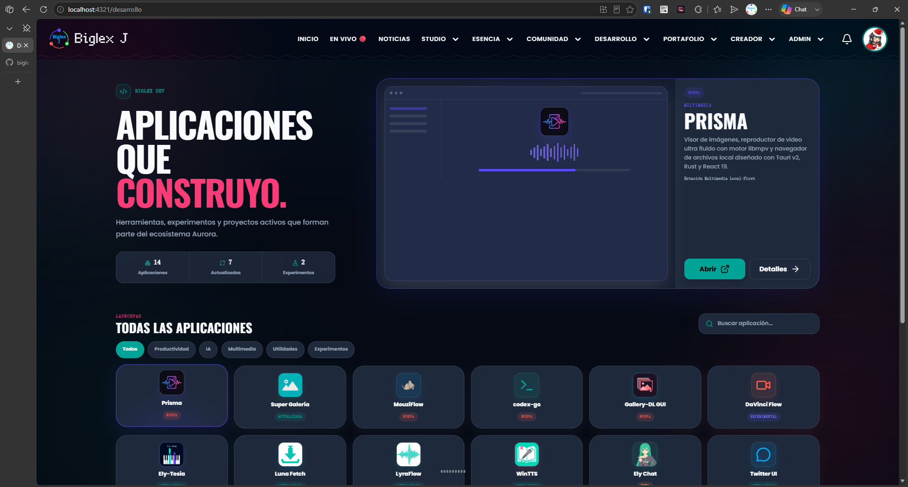
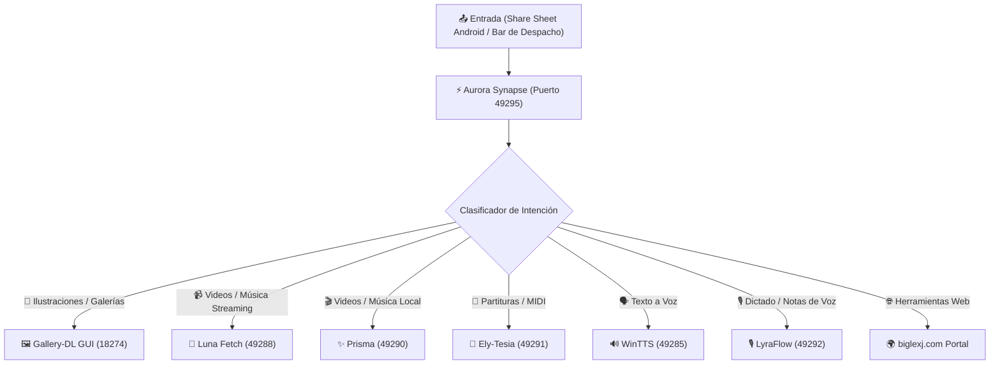

# ⚡ Aurora Synapse

> **Orquestador Universal, Clasificador de Intención y Launchpad Multiplataforma para el Ecosistema Aurora.**

[](LICENSE)
[](https://v2.tauri.app)
[](#)
[](https://biglexj.com)

---

## 📸 Capturas de Pantalla

| Modo oscuro | Modo claro |
| :---: | :---: |
|  |  |

---

## 🏛️ ¿Qué es Aurora Synapse?

**Aurora Synapse** es la aplicación central de despacho y enrutamiento inteligente del ecosistema **biglexj**. Actúa como el puente universal de comunicación tanto entre dispositivos (teléfono Android ↔ PC con Windows) como entre aplicaciones satélite nativas y herramientas web.

En lugar de requerir emparejamientos individuales en cada aplicación, **Aurora Synapse** recibe el contenido desde el *Share Sheet* de Android o la barra de despacho en PC, analiza la intención mediante reglas deterministas de dominio y tipo MIME, y enruta el payload inmediatamente a la aplicación especializada correcta:



---

## ✨ Características Principales

- 🧠 **Clasificador Inteligente de Intención**: Detección en tiempo real de URLs, redes sociales (YouTube, TikTok, Twitter/X), plataformas de arte (DeviantArt, Pixiv, ArtStation) y extensiones de archivo locales (`.mid`, `.mp4`, `.m4a`, `.txt`).
- 🚀 **Launchpad Unificado del Ecosistema**:
  - Pestaña **`Aplicaciones`**: Catálogo de aplicaciones nativas instalables con insignias de estado (*NUEVA*, *ACTUALIZADA*, *EXPERIMENTAL*, *PROXIMAMENTE*).
  - Pestaña **`Web`**: Suite completa de herramientas de desarrollo, estudio musical, chat comunitario y analíticas de `biglexj.com`.
- 📐 **Diseño Fluido y Rejilla Adaptativa**: Aprovechamiento total del 100% del ancho de pantalla con escalado dinámico de 2 a 6 columnas.
- ⚙️ **System Tray & Residencia en Segundo Plano**: Minimización a la bandeja del sistema al presionar `X` para escucha reactiva permanente en segundo plano.
- 🔄 **Persistencia de Ventana**: Recuerda automáticamente tamaño, posición y estado de maximizado (`tauri-plugin-window-state`).
- ⚡ **Auto-Run**: Opción de inicio automático con Windows sin fricción.

---

## 🛠️ Desarrollo Local

### Requisitos
- [Bun](https://bun.sh) (v1.1+)
- [Rust](https://www.rust-lang.org) (v1.85+)
- [Android Studio & NDK](https://developer.android.com) (opcional para compilar en Android)

### Iniciar en Desarrollo
```bash
# Instalar dependencias
bun install

# Ejecutar aplicación de escritorio en modo desarrollo
bun run tauri dev
```

### Compilar e Instalar en Android
```bash
powershell.exe -ExecutionPolicy Bypass -File .\scripts\build\install-android.ps1
```

### Compilar Release de Producción (Windows)
```bash
powershell.exe -ExecutionPolicy Bypass -File .\scripts\build\build-release.ps1 -Version "0.1.0"
```

---

## 📜 Licencia & Autor

- **Licencia**: GNU General Public License v2.0 (`GPL-2.0`)
- **Autor**: [Biglex J](https://www.biglexj.com) (2026)
- **Donaciones Oficiales**: [biglexj.com/donaciones](https://www.biglexj.com/donaciones) · [Buy Me a Coffee](https://buymeacoffee.com/biglexj)
